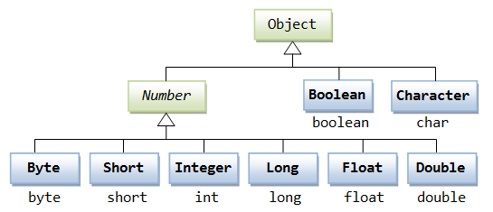

# Wrapper Classes

Wrapper classes provide a way to use primitive data types ( int , boolean , etc..) as objects.

* Contained in java.util
* Corresponding number range still applies
* Default value "null"
* Immutable

Practice Test2 Question 43

## Useful for

* Comparing primitives to other objects

* Storing primitive type variables in Collections (Lists, Vectors, Maps etc.)

[Next](Autoboxing.md)
